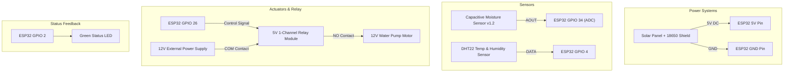

# Smart Krishi AI - IoT Hardware & Circuit Schematic Guide

This document specifies the pinout mapping, wiring diagrams, relay safety controls, and component specifications for the **Smart Krishi AI** ESP32 IoT Node and Automatic Irrigation System.

---

## 1. Hardware Component List

| Component | Specification / Model | Purpose |
| :--- | :--- | :--- |
| **Microcontroller** | ESP32-WROOM-32 DevKit v1 | Core MCU with 2.4GHz WiFi & Bluetooth |
| **Soil Moisture Sensor** | Capacitive Soil Moisture v1.2 (Analog) | Corrosion-resistant soil moisture measurement |
| **Temp & Humidity Sensor** | DHT22 (AM2302) | Ambient temperature and humidity sensor |
| **Relay Module** | 5V 1-Channel Relay (Optocoupler Isolated) | Controls 12V / 220V Water Pump Motor |
| **Water Pump Motor** | 12V DC Submersible Mini Pump | Drip/Sprinkler irrigation delivery |
| **Status LED / Beeper** | 5mm Green LED + 220Ω Resistor | Visual indication of WiFi/Pump status |
| **Power Supply** | Solar Panel 5V 2A + 18650 Li-ion Shield | Field power with battery level monitoring |

---

## 2. ESP32 Pin Mapping Table

| ESP32 Pin | Connected Hardware Pin | Function |
| :--- | :--- | :--- |
| **GPIO 34 (ADC1_CH6)** | Capacitive Moisture Sensor `AOUT` | Analog Soil Moisture Signal (0-4095) |
| **GPIO 4** | DHT22 `DATA` Pin | Digital Temperature & Humidity Input |
| **GPIO 26** | 5V Relay `IN` Pin | Pump Control Trigger (Active LOW) |
| **GPIO 35 (ADC1_CH7)** | Battery Voltage Divider Output | Analog Battery Monitor Signal |
| **GPIO 2** | Status Green LED | WiFi / System Heartbeat Indicator |
| **5V (VIN)** | Sensor `VCC` & Relay `VCC` | 5V DC Power Rail |
| **GND** | System Ground Rail | Common Ground |

---

## 3. Circuit Connections Diagram

---

## 4. Hardware Safety & Relay Wiring Rules

1. **Optocoupler Isolation**: The 5V relay module utilizes an optocoupler to prevent voltage spikes from motor inductive flyback from reaching the ESP32.
2. **Active-LOW Trigger**: ESP32 outputs `LOW` to close the relay contact and turn the pump ON, preventing unexpected pump starts during initial ESP32 bootup.
3. **Hardware Watchdog Timeout**: Continuous continuous pump operation is hard-coded to shut off automatically after 30 minutes in case of sensor disconnect or pipe blockage.
4. **Flyback Diode Protection**: A 1N4007 flyback diode is placed anti-parallel across DC pump terminals.

---

## 5. Wokwi Simulation Setup

To simulate this circuit online without physical hardware:
1. Open [Wokwi ESP32 Simulator](https://wokwi.com/).
2. Add components: ESP32 DevKit v1, DHT22 Sensor, Potentiometer (for soil moisture simulation), and Relay Module.
3. Upload `smart_krishi_esp32.ino` and `config.h`.
4. Connect to Wokwi-GUEST WiFi for live HTTP requests to the FastAPI backend!
